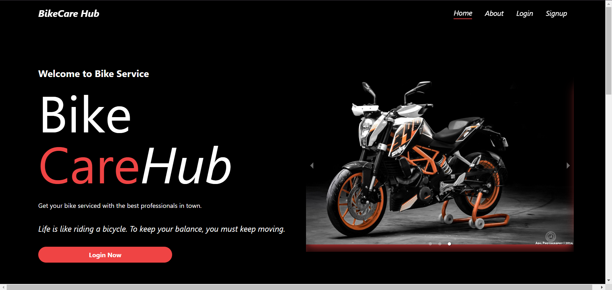
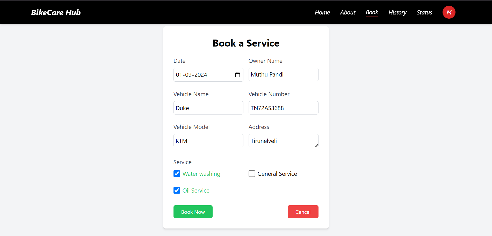
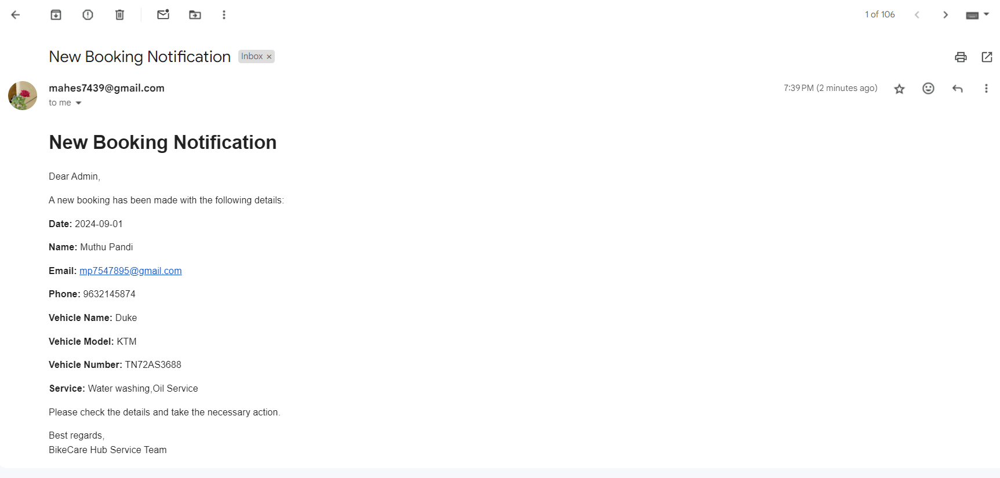
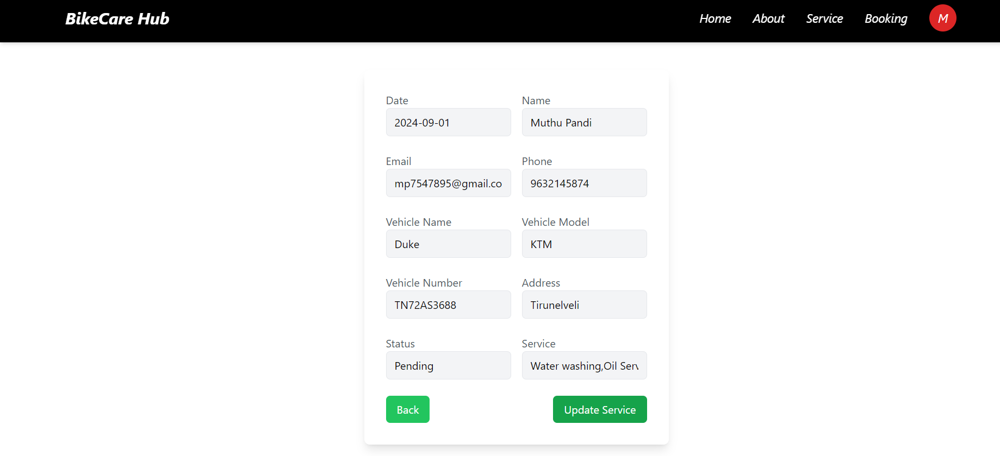

# BikeCare Hub

## Project Overview

**BikeCare Hub** is a comprehensive bike service application that connects bike service station owners with customers seeking reliable bike maintenance and repair services. The platform allows users to book services, manage bookings, and receive notifications, while providing bike station owners with a streamlined way to list and manage their services.

## Features

- User registration and login
- Booking services
- Admin panel for managing services and bookings
- Email notifications for bookings
- Dashboard for viewing current bookings and status

## Technologies Used

- **Frontend**: React.js, Tailwind CSS
- **Backend**: Node.js, Express.js
- **Database**: MongoDB
- **HTTP Requests**: Axios

## Installation Instructions

### Prerequisites

- Node.js and npm installed
- MongoDB server running

### Clone the Repository
```bash
git clone https://github.com/ms-maheswari/bike-care-hub.git
cd bike-care-hub
```

### Client
```bash
cd client
npm install
```
### Server
```bash
cd ../server
npm install
```
### Configuration
1. Create a .env file in the server directory with the following environment variables:

```env
MONGODB_URI=mongodb://localhost:5000/bikecarehub
EMAIL_USER=your_email_user
EMAIL_PASS=your_email_password
```
2. Replace your_email_user, and your_email_password with your actual values.

### Running the Application

Start the Backend Server
```bash
cd server
npm start
```
Start the Frontend Client
```bash
cd ../client
npm start
```
The application should now be running on http://localhost:3000 for the frontend and http://localhost:5000 for the backend.

### Database Schema

### Customer Collection
```json
{
  "_id": "ObjectId",
  "email": "String",
  "phone": "String",
  "pass": "String", 
  "role": "String" 
}
```

### Admin Collection
```json
{
  "_id": "ObjectId",
  "email": "String",
  "phone": "String",
  "pass": "String", 
  "role": "String" 
}
```

### AddService Collection
```json
{
  "_id": "ObjectId",
  "sname": "String", 
  "sdesc": "String", 
  "samount": "String" 
}
```
### AddBooking Collection
```json
{
  "_id": "ObjectId",
  "date": "String",
  "name": "String", 
  "email": "String", 
  "phone": "String", 
  "vname": "String", 
  "vno": "String", 
  "vmodel": "String", 
  "address": "String", 
  "status": "String", 
  "service": ["String"] 
}
```


## Screenshots

This is the Home page that contains navbar, landing page, available services, and footer



Available Services


This is the Login page


This is the Signup page


### Customer Activities

This is the page where customer can make their booking after successful login



Once the customer finish their booking they can check their booking status


Once the service is completed then it will be displayed in history page


### Admin Activities

After a customer booked a service admin will receive a email regarding booking details



Admin can perform CRUD operation in Services


Admin dashboard showing list of services


Admin dashboard showing list of customer bookings where they can sort bookings based on pending, ready and completed


Once the admin click on the view button in booking section it navigates to this page where they can click on update button to update the booking status. 



After that an email will be sent to the respective customer about their service booking status


